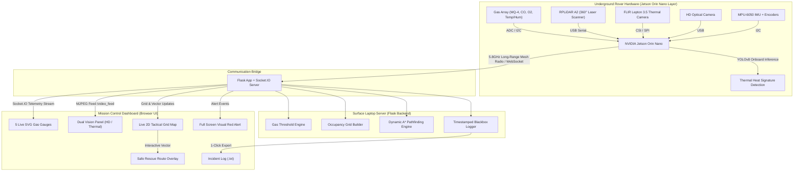
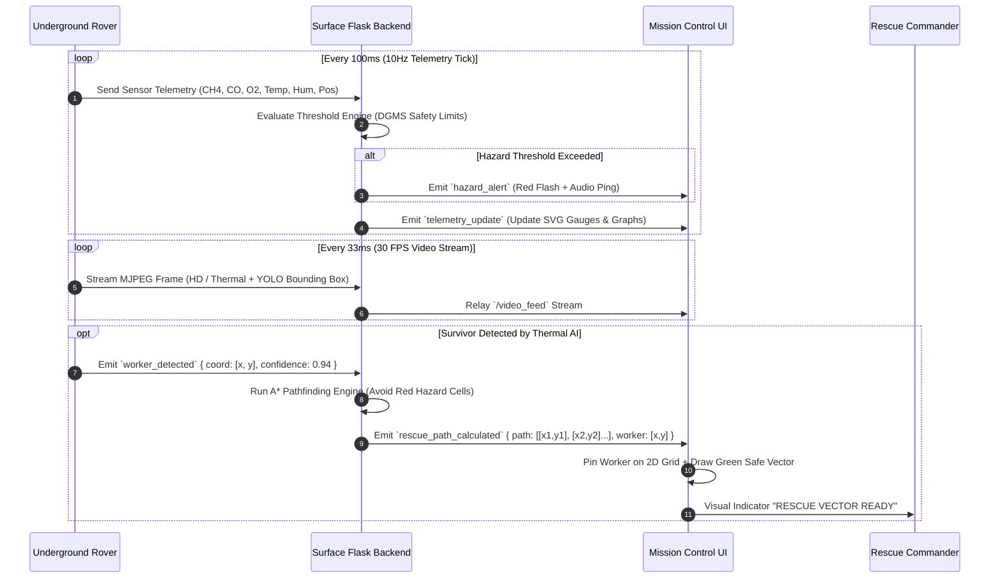
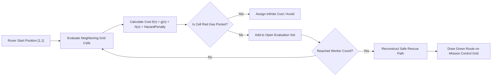
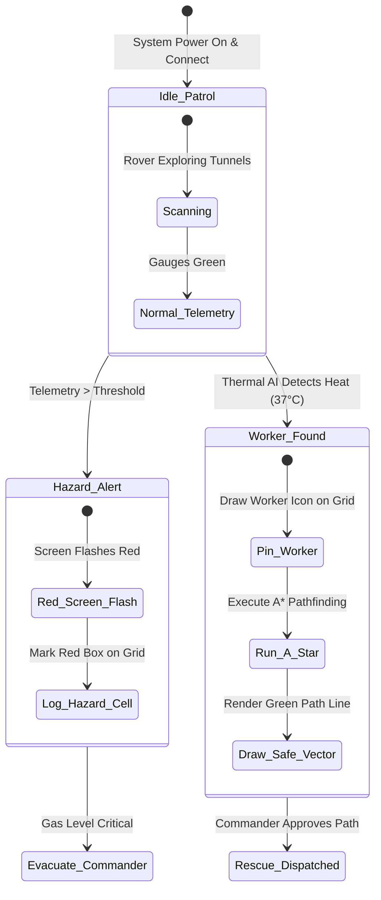

# 🔴 AI-Powered Underground Mine Safety, Monitoring & Rescue System
> **Core Identity:** SENSE. SEE. SAVE.  
> **Target Domain:** Jharkhand Underground Coal Mines Safety & Disaster Reconnaissance

---

## 📌 Executive Summary

Underground coal mining environments pose critical risks of explosive Methane ($\text{CH}_4$) accumulation, deadly Carbon Monoxide ($\text{CO}$) poisoning, oxygen depletion, structural cave-ins, and zero-visibility coal dust clouds. During disasters, sending human rescue teams in without situational awareness creates severe risks of secondary casualties.

This project delivers a **ruggedized autonomous hazard-scanning rover** paired with a **surface-level tactical mission control dashboard**. The rover enters disaster zones first, scans atmospheric hazards, locates trapped miners using AI-enhanced thermal imaging, and dynamically computes gas-avoiding rescue vectors using $A^*$ pathfinding.

---

## 🏗️ End-to-End System Architecture



---

## 🔄 Real-Time Data & Event Flow



---

## 🔩 Hardware Specification & Sensor Topology

| Module | Component / Sensor | Communication Protocol | Operational Function |
|---|---|---|---|
| **Primary Compute** | NVIDIA Jetson Orin Nano (8GB) | Internal PCIe / USB 3.2 | 40 TOPS AI compute, runs YOLOv8 at 30 FPS locally |
| **Methane Sensor** | MQ-4 / Figaro TGS2611 | Analog → ADS1115 ADC (I2C) | Measures $\text{CH}_4$ volume % (DGMS Alarm threshold: 1.25%) |
| **Carbon Monoxide** | MQ-7 / Electrochemical | Analog → ADS1115 ADC (I2C) | Measures $\text{CO}$ concentration in PPM (OSHA Alarm: 25 PPM) |
| **Oxygen Cell** | Electrochemical $\text{O}_2$ Sensor | Analog → ADS1115 ADC (I2C) | Measures $\text{O}_2$ % depletion (Alert limit: < 19.5%) |
| **Climate Array** | SHT31 / DHT22 | Digital Single-Bus / I2C | Ambient Temperature (°C) & Relative Humidity (%) |
| **Thermal Camera** | FLIR Lepton 3.5 Radiometric | SPI (Video) + I2C (Control) | Detects 37°C body heat signatures through dense dust |
| **LiDAR Scanner** | RPLiDAR A2M8 (12m range) | UART → USB Serial | 360° 2D laser mapping for tunnel occupancy grid |
| **IMU / Odometry** | MPU-6050 + Optical Encoders | I2C / GPIO Interrupts | Dead-reckoning position estimation without GPS |
| **Long-Range Link** | 5.8GHz Mesh Wireless Radio | Ethernet / TCP-IP | High-throughput data tunnel between mine & surface |

---

## 💻 Software Architecture & Code Structure

### Directory Layout
```
mine_rescue_rover/
├── laptop_server/
│   ├── app.py                      # Flask backend, Socket.IO handlers, A* engine
│   └── dashboard/
│       ├── templates/
│       │   └── index.html          # Mission Control UI (CSS Glassmorphism + JS)
│       └── static/
│           ├── css/
│           └── js/
├── raspberry_pi/                   # Embedded telemetry collection daemon
├── esp32/                          # Motor controller & hardware bridge firmware
├── esp_cam/                        # Dual camera relay firmware
└── README.md                       # Master System Specification
```

---

## 🧮 Data Schemas & WebSocket API Specification

### 1. Telemetry Payload Schema (`telemetry_data`)
```json
{
  "timestamp": 1727453400.125,
  "rover_id": "ROVER_ALPHA_01",
  "position": { "x": 4.5, "y": 2.1, "heading": 180.0 },
  "sensors": {
    "ch4": { "value": 1.45, "unit": "%", "status": "CRITICAL" },
    "co": { "value": 28.5, "unit": "ppm", "status": "WARNING" },
    "o2": { "value": 19.1, "unit": "%", "status": "WARNING" },
    "temp": { "value": 36.2, "unit": "°C", "status": "NORMAL" },
    "humidity": { "value": 78.0, "unit": "%", "status": "NORMAL" }
  },
  "battery": 88,
  "signal_dbm": -62
}
```

### 2. Hazard Alert Event Schema (`hazard_alert`)
```json
{
  "alert_id": "ALT_99201",
  "type": "GAS_SPIKE_BREACH",
  "severity": "CRITICAL",
  "sensor": "ch4",
  "value": 1.45,
  "threshold": 1.25,
  "grid_cell": [3, 5],
  "message": "CH4 level exceeded safe threshold of 1.25% at cell [3,5]"
}
```

### 3. Worker Detected & Rescue Path Schema (`worker_found`)
```json
{
  "worker_id": "VICTIM_01",
  "confidence": 0.94,
  "grid_position": [8, 7],
  "thermal_max_temp": 37.4,
  "rescue_path": [
    [1, 1], [1, 2], [2, 2], [3, 2], [4, 2], 
    [5, 3], [6, 4], [7, 5], [8, 6], [8, 7]
  ],
  "path_distance_m": 14.2
}
```

---

## 🧠 Dynamic A* Pathfinding Engine

The pathfinder operates over a 2D occupancy grid where cells are classified into three states:
* `0 = CLEAR`: Navigable tunnel cell.
* `1 = STRUCTURAL_OBSTACLE`: Blocked by cave-in or rubble.
* `2 = GAS_HAZARD`: High concentration gas pocket ($\text{CH}_4 \ge 1.25\%$ or $\text{CO} \ge 25\text{ ppm}$).

### Node Evaluation Function
$$f(n) = g(n) + h(n) + w(n)$$

Where:
* $g(n)$: Exact movement cost from start node to node $n$.
* $h(n)$: Euclidean distance heuristic to worker destination:
  $$h(n) = \sqrt{(x_{worker} - x_n)^2 + (y_{worker} - y_n)^2}$$
* $w(n)$: Hazard Penalty Weight factor. If node $n$ is adjacent to a gas pocket, $w(n) = +50$ cost multiplier to ensure a safe buffer zone.



---

## 🕹️ Mission Control UI & Visual System State



---

## 📋 Evaluation & Demonstration Scenarios

1. **Scenario 1 — Gas Leak Breach (`Demo Key 1`):**
   * Artificially spikes $\text{CH}_4$ to $1.45\%$ and $\text{CO}$ to $28\text{ PPM}$.
   * **Result:** Gauges switch to Red zone, red flash alert overlays screen, and gas cells $[2,5]$ & $[3,5]$ highlight as danger zones.

2. **Scenario 2 — Structural Cave-In (`Demo Key 2`):**
   * Simulates sudden obstacle detection via LiDAR.
   * **Result:** Grid cells marked blocked, dynamic path recalculation re-routes around rubble.

3. **Scenario 3 — Worker Rescue Lock (`Demo Key 3`):**
   * Simulates thermal AI lock on trapped worker heat signature at $[8,7]$.
   * **Result:** Worker pin drops on grid, $A^*$ pathfinder computes optimal path avoiding gas pockets, green vector drawn for rescue team.

---

## 🚀 Key Differentiators & Hackathon Edge

1. **Zero Human Entry Risk:** Surface command receives a complete tactical map before any human steps inside.
2. **Dust-Penetrating Thermal Vision:** Standard cameras fail in coal dust; FLIR radiometric thermal imaging locates survivors by heat signatures.
3. **Gas-Aware Path Generation:** Does not merely find the shortest path—actively routes around volatile gas pockets.
4. **100% Offline Capability:** Runs completely locally on a surface laptop without internet or cloud dependency.

---
> *"Raw data goes in underground. Clear, life-saving decisions come out on screen."*  
> **We don't guess. We know.**
